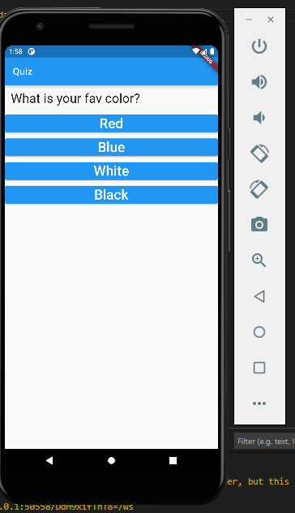
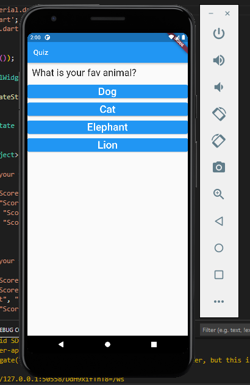
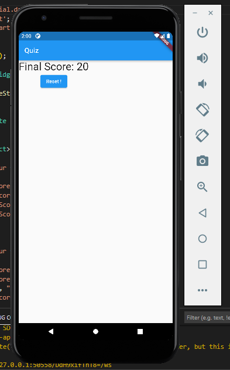

# Quiz-App-

<h3><u>FIRST screen :</u></h3>
<h4>you must choose answer for the first question </h4>

   
  

   
  <h3><u>SECONDE screen :</u></h3>
 <h4>answer the seconde question </h4>

   
  

   
 
  <h3><u>THIRD screen :</u></h3>
  Then it will show you the Quiz result and the reset button where she able to you to restart the quiz 

   
  

   
 
